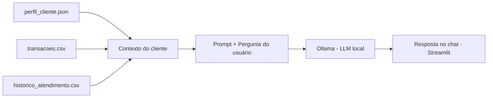

# 🤖 Kali — Agente Financeiro Inteligente


Agente de IA que roda 100% localmente e ajuda a organizar a vida financeira com base nos dados reais do usuário — perfil, transações e histórico de atendimento — sem depender de nenhuma API paga na nuvem.

> Projeto desenvolvido como desafio do bootcamp da DIO **"Agente Financeiro Inteligente com IA Generativa"**, a partir do fork de [`digitalinnovationone/dio-lab-bia-do-futuro`](https://github.com/digitalinnovationone/dio-lab-bia-do-futuro), com código, dados e prompt reescritos como solução própria.

---

## 📑 Sumário

- [Sobre o projeto](#-sobre-o-projeto)
- [Como funciona](#-como-funciona)
- [Estrutura do projeto](#-estrutura-do-projeto)
- [Tecnologias](#-tecnologias)
- [Pré-requisitos](#-pré-requisitos)
- [Como rodar](#-como-rodar)
- [Exemplo de uso](#-exemplo-de-uso)
- [Dados utilizados](#-dados-utilizados)
- [Prompt do agente](#-prompt-do-agente)
- [Limitações e próximos passos](#-limitações-e-próximos-passos)
- [Créditos](#-créditos)

---

## 💡 Sobre o projeto

Assistentes financeiros tradicionais costumam ser reativos: só respondem o que é perguntado. O **Kali** foi pensado para ser mais proativo — ele lê o contexto financeiro real do cliente (renda, gastos, metas e histórico) antes de responder, e usa isso para dar sugestões personalizadas em vez de respostas genéricas.

Todo o processamento acontece localmente, via [Ollama](https://ollama.com) — nenhum dado financeiro do usuário sai da máquina ou é enviado para serviços de terceiros.

## ⚙️ Como funciona

1. O app carrega o perfil do cliente (`perfil_cliente.json`), o histórico de transações (`transacoes.csv`) e o histórico de atendimentos (`historico_atendimento.csv`).
2. Calcula **dinamicamente** quanto já foi gasto no mês e quanto ainda pode ser gasto, direto a partir das transações — nenhum valor fica fixo no perfil, então o cálculo sempre reflete a realidade atual.
3. Monta um contexto único com esses dados e envia, junto da pergunta do usuário, para um modelo de IA rodando localmente via Ollama.
4. A resposta aparece em uma interface de chat construída com [Streamlit](https://streamlit.io).



## 📂 Estrutura do projeto

```
dio-lab-bia-do-futuro/
├── data/
│   ├── perfil_cliente.json          # dados do cliente e metas
│   ├── transacoes.csv               # histórico de transações
│   └── historico_atendimento.csv    # histórico de atendimentos
├── src/
│   └── app.py                       # aplicação principal (Streamlit)
├── docs/                            # documentação do desafio (caso de uso, prompts, métricas)
├── assets/                          # imagens e diagramas
└── examples/                        # referências de implementação da DIO
```

## 🛠️ Tecnologias

| Tecnologia | Função no projeto |
|---|---|
| **Python** | linguagem principal |
| **Streamlit** | interface de chat web |
| **Ollama** | inferência de LLM local (modelo configurável, ex: `llama3.2:1b`) |
| **Pandas** | leitura e processamento dos dados financeiros (CSV) |
| **Requests** | comunicação com a API local do Ollama |

## ✅ Pré-requisitos

- Python 3.10+
- [Ollama](https://ollama.com/download) instalado
- Um modelo baixado no Ollama (recomendado para notebooks sem GPU: `llama3.2:1b`)

## 🚀 Como rodar

1. Clone o repositório:
   ```bash
   git clone https://github.com/MuriloFavoni/dio-lab-bia-do-futuro.git
   cd dio-lab-bia-do-futuro
   ```
2. Instale as dependências:
   ```bash
   pip install streamlit pandas requests
   ```
3. Baixe um modelo no Ollama (se ainda não tiver):
   ```bash
   ollama pull llama3.2:1b
   ```
4. Rode a aplicação a partir da raiz do projeto:
   ```bash
   streamlit run ./src/app.py
   ```
5. Acesse em `http://localhost:8501`.

## 💬 Exemplo de uso

```
Usuário: Posso comprar um tênis de R$ 300 esse mês?

Kali: Com base na sua renda de R$ 5.000 e nos R$ 2.500 já
comprometidos em gastos fixos, ainda sobram R$ 1.100 livres
neste mês. Uma compra de R$ 300 é viável, mas reduziria em
27% o valor que você tinha disponível para direcionar à sua
meta de reserva de emergência (faltam R$ 5.000 até junho/2026).
```

## 🗃️ Dados utilizados

| Arquivo | Formato | Conteúdo |
|---|---|---|
| `perfil_cliente.json` | JSON | nome, renda, profissão, patrimônio, metas financeiras |
| `transacoes.csv` | CSV | histórico de entradas e saídas do cliente |
| `historico_atendimento.csv` | CSV | interações anteriores do cliente com atendimento |

Todos os dados são **mockados** (fictícios), criados apenas para fins de estudo — nenhuma informação financeira real é utilizada.

## 🧠 Prompt do agente

O Kali segue um *system prompt* com regras fixas de comportamento, entre elas:

- Basear toda resposta nos dados reais fornecidos no contexto
- Nunca inventar informações financeiras (anti-alucinação)
- Admitir quando não souber algo, em vez de arriscar um palpite
- Comunicar de forma clara, adaptada ao entendimento do cliente

## 🔭 Limitações e próximos passos

- [ ] Adicionar interface para o usuário editar seu próprio perfil pelo app
- [ ] Persistir novas transações direto pela interface (hoje é só leitura do CSV)
- [ ] Avaliar métricas de qualidade das respostas (precisão, taxa de alucinação)
- [ ] Testar modelos maiores via GPU na nuvem para comparar qualidade de resposta
- [ ] Gravar o pitch de apresentação do projeto

## 🙌 Créditos

Projeto base (estrutura e desafio): [`digitalinnovationone/dio-lab-bia-do-futuro`](https://github.com/digitalinnovationone/dio-lab-bia-do-futuro)
Solução desenvolvida por: [Murilo Favoni](https://github.com/MuriloFavoni)
